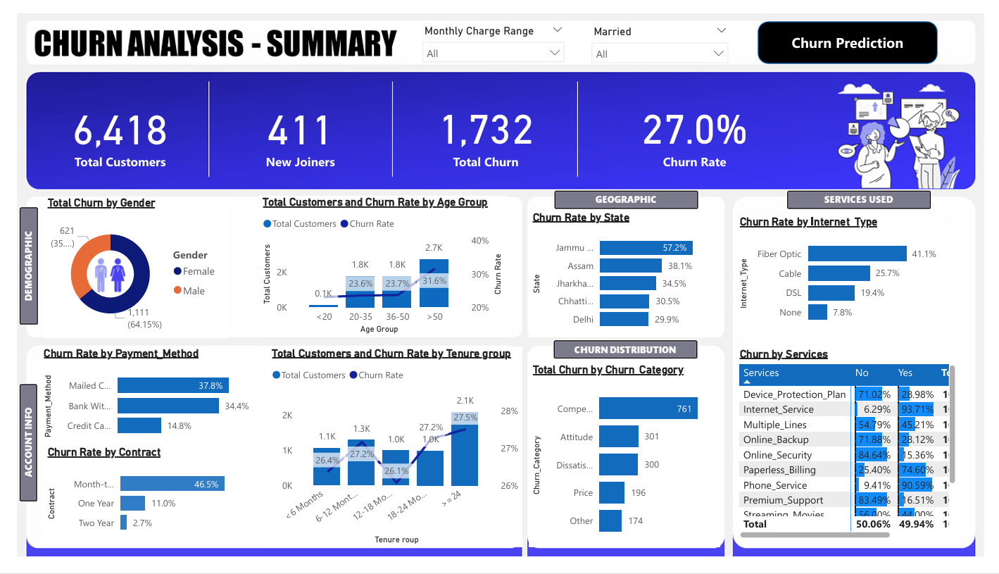
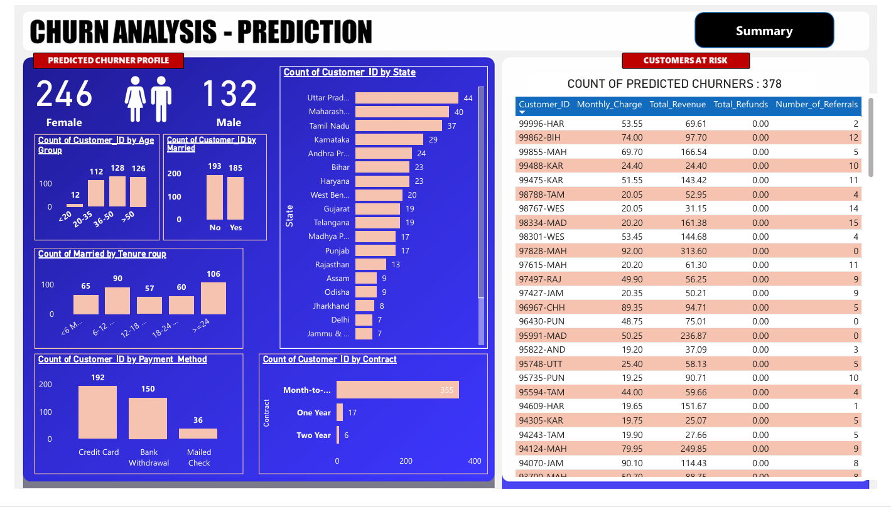

# Customer-Churn-Prediction
## Project Overview
*Analyzed 7.0K+ telecom customer records to identify churn patterns, predict high-risk customers using a Random Forest model, and build interactive dashboards for monitoring churn KPIs and customer segments.
The project combines Machine Learning (for churn prediction) with Business Intelligence dashboards (for churn monitoring & storytelling).*

 ---
## 1.Objectives
- Identify key factors driving churn (contracts, tenure, billing, services).
- Build a Random Forest model to predict customer churn.
- Segment customers by demographics, services, and payment methods.
- Develop interactive dashboards for business insights.
- Provide data-driven retention strategies.

   ---

## 2.Dataset
- Source: Churn Dataset
 ### [Customer_Data.csv]https://github.com/abhi28408/Customer-Churn-Prediction/blob/main/Customer_Data.csv
- Shape: ~7,000 rows × 20 columns
- Features: Customer demographics, contract details, billing, payment methods, services.
- Target: Churn (Yes / No)

 ---
## 3. Key KPIs
- Total Customers
- Total Churned Customers
- Churn Rate (%)
- New Joiners vs Exits
- Churn by Contract Type, Tenure, Payment Method, Services

 ---
## 4. Machine Learning Approach
#### Model Used: Random Forest Classifier
##### Steps:
- Data Cleaning & Preprocessing
- Feature Encoding (categorical → numeric)
- Train/Test Split (80/20)
- Model Training & Evaluation (Accuracy, Precision, Recall, F1)
- Churn Probability Scoring
### [Churn_ml.pdf]https://github.com/abhi28408/Customer-Churn-Prediction/blob/main/Churn_ml.pdf
### [Churn_Predictions_ML data.csv]https://github.com/abhi28408/Customer-Churn-Prediction/blob/main/Churn_Predictions_ML%20data.csv
 ---
## 5.Dashboards
🔹 Churn Summary Dashboard

🔹 Churn Prediction Dashboard

 ---
## 6.Tools & Technologies
- Python (Pandas, NumPy, Scikit-learn, Matplotlib, Seaborn)
- Random Forest Classifier
- Power BI / Streamlit for dashboards
- GitHub for project versioning

 ---
## 7.Process
### Data Understanding
- Collected 7,000+ customer records with demographics, contracts, services, billing, and churn label.
### Data Cleaning & Preparation
- Handled missing values
- Encoded categorical variables (e.g., Contract Type, Payment Method)
- Standardized numerical fields (tenure, monthly charges, total charges).
### Exploratory Data Analysis (EDA)
- Visualized churn distribution by contract type, payment method, and tenure.
- Identified correlations between features and churn.
### Feature Engineering
- Created derived features like Tenure Groups (New, Medium, Loyal).
- Converted categorical fields into dummy variables for ML.
### Model Development
- Train/Test split (80/20).
- Applied Random Forest Classifier for churn prediction.
- Evaluated with Accuracy, Precision, Recall, F1-score, ROC-AUC.
### Dashboard Development
- Built interactive dashboards in Power BI for:
- Churn Overview & KPIs
- Customer Segmentation
- Prediction Monitoring
### Insights & Recommendations
-  Month-to-month customers & electronic check users are at high churn risk.
- Longer tenure and auto-pay customers have significantly lower churn.
-  Business should offer loyalty benefits & discounts for short-tenure customers.

 ---
## 8.Final Conclusion (for Churn Prediction)
- The churn rate is 26.5%, mainly driven by month-to-month contracts, electronic check payments, and short tenure customers.
- Customers with longer tenure and automatic payment methods are more loyal and less likely to churn.
- The Random Forest Model achieved 82% accuracy, making it a reliable tool to predict at-risk customers.
-  By proactively targeting new customers and month-to-month subscribers with discounts, loyalty rewards, and flexible contract upgrades, churn can be reduced by an estimated 15–20% annually.
- This project provides both predictive power (ML model) and strategic visibility (Power BI dashboards) for real-world retention strategies.

Model Training & Evaluation (Accuracy, Precision, Recall, F1)

Churn Probability Scoring
